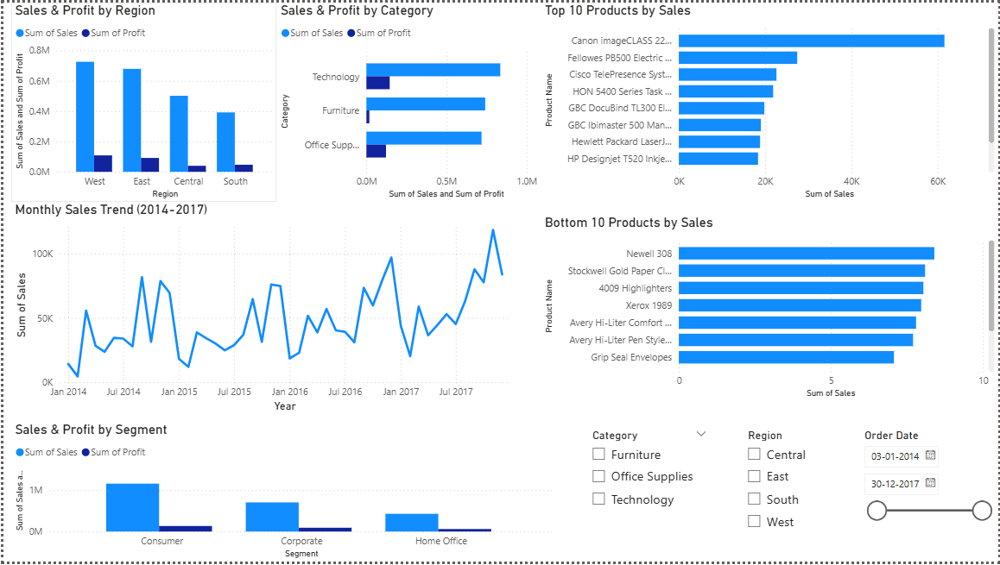
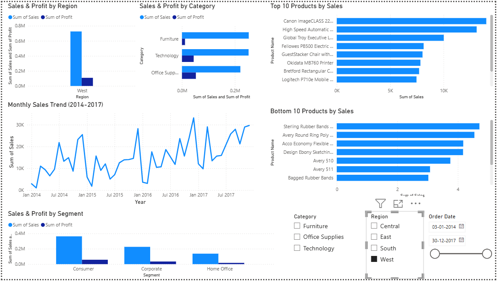
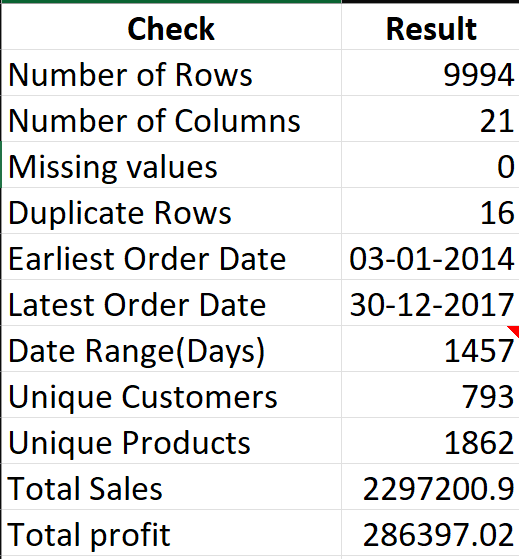

# Superstore Sales & Profitability Analysis

An end-to-end analysis of four years (2014–2017) of Superstore sales data using Microsoft Excel and Power BI. The project focuses on data validation, exploratory analysis, profitability trends, and interactive dashboard development to generate meaningful business insights.

## 🛠 Tools Used

- **Microsoft Excel** — Data validation, data cleaning, calculated columns, pivot tables, and charts
- **Power BI Desktop** — Interactive dashboard, visualizations, cross-filtering, and slicers
- **Dataset:** Sample Superstore dataset (9,994 records, 2014–2017)

## 📊 Project Structure

```text
├── Superstore_Excel.xlsx       → Excel workbook
├── Superstore_Dashboard.pbix   → Power BI dashboard
├── screenshots/                → Dashboard preview images
└── README.md
```

## 🔍 Project Process

### Phase 1 — Excel: Data Validation & Exploratory Analysis

- Performed data validation checks for missing values, row counts, and duplicate records.
- Checked and corrected date formatting issues to support accurate date-based analysis.
- Added calculated columns such as Order Year, Order Month, Profit Margin %, and Shipping Duration.
- Created pivot tables and charts to analyze:
  - Sales and Profit by Region
  - Sales and Profit by Category and Sub-Category
  - Monthly Sales Trends
  - Top and Bottom Products by Sales
  - Customer Segment Performance

### Phase 2 — Power BI: Interactive Dashboard

- Recreated the main analysis using interactive Power BI visuals.
- Added slicers for Category, Region, and Order Date.
- Used cross-filtering to explore relationships between different business dimensions.
- Designed a dashboard to support sales and profitability analysis.

## 💡 Key Business Insights

### 1. Sales Growth and Monthly Trends

Sales increased by approximately 56% from 2015 to 2017, growing from $470.5K to $733.2K. Sales were generally stronger during the later months of the year, with fluctuations across different years. This suggests that the business can study seasonal patterns to improve inventory and sales planning.

### 2. Regional Performance

West recorded the highest Sales, Profit, and Profit Margin among the four regions. Central generated the second-highest Sales but had the lowest Profit Margin, showing that high sales do not always result in high profitability. The company should investigate Central's discount levels, product mix, and operating costs.

### 3. Category and Sub-Category Profitability

Furniture generated the second-highest Sales among the three categories but recorded the lowest Profit. Tables and Bookcases contributed to the category's profitability challenges, with negative profits in the dataset. This suggests the need to investigate discounting, product costs, and pricing strategies.

### 4. Product-Level Profitability

The analysis shows that high product sales do not always guarantee high profits. Some products with strong sales recorded low or negative profits. This highlights the importance of evaluating both Sales and Profit when making product-level business decisions.

### 5. Customer Segment Performance

Consumer is the largest customer segment, generating the highest Sales, Profit, and Order Count. Corporate is the second-largest segment, while Home Office contributes the lowest overall Sales and Profit. The company can analyze each segment's purchasing behavior to develop suitable sales and customer retention strategies.

## 📊 Dashboard Screenshots

### 1. Power BI Dashboard Overview

The dashboard provides an overview of sales performance using interactive visualizations.



### 2. Power BI Dashboard – West Region

The dashboard is filtered to the West region to analyze regional sales performance.



### 3. Excel Data Validation

Data validation checks were performed in Excel to verify the number of rows, columns, missing values, and duplicate records before dashboard development.



## 🧠 Skills Demonstrated

- Data Validation and Data Cleaning
- Exploratory Data Analysis
- Microsoft Excel Pivot Tables and Charts
- Power BI Dashboard Development
- Data Visualization
- Profitability Analysis
- Business Insight Generation
- Analytical Thinking and Problem Solving

## 📌 Key Takeaway

This project demonstrates how raw sales data can be transformed into meaningful business insights using Excel and Power BI. It highlights the importance of analyzing profitability alongside sales, identifying underperforming products and regions, and using interactive dashboards to support business decision-making.

## 📬 Contact

**Name:** Hamna Muhammed

**LinkedIn:** *linkedin.com/in/hamna-muhammed-272386230*

**Email:** *hamnaamuhd@gmail.com*
